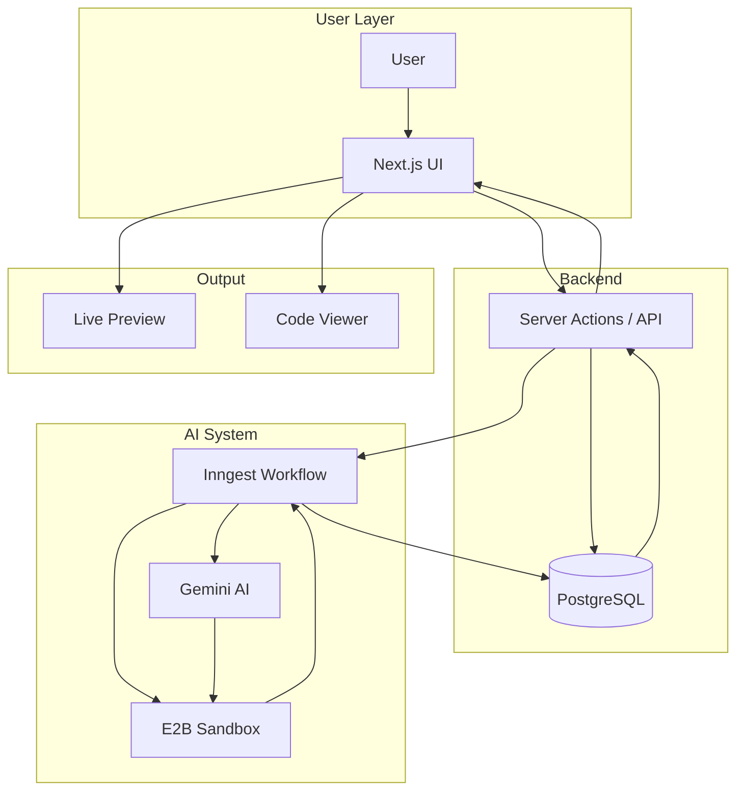
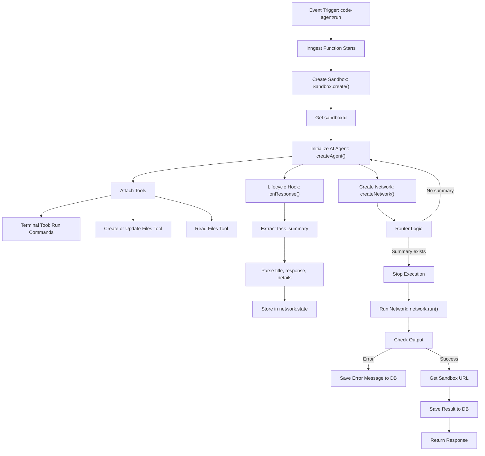

# 🚀 StackGen — AI-Powered Full-Stack App Generator

> Turn ideas into fully functional applications — instantly.
> StackGen is an autonomous AI software engineer that **writes, runs, debugs, and deploys code** in a secure cloud sandbox.

---

## 🏆 Badges


---

## 🌐 Live Demo

🚀 **Try it now:** https://stackgen.live

- 🧠 Generate full-stack apps from prompts
- ⚡ Watch AI write, run, and debug code
- 👀 Explore live previews and generated source code

---

## 🌟 Overview

StackGen is an **AI-powered full-stack application generator** that goes beyond traditional code generation.

It doesn’t just write code — it:

- ⚡ Executes it in a real environment
- 🐞 Detects runtime errors
- 🔄 Fixes issues automatically
- ✅ Iterates until the application works

👉 Think of it as a **self-improving AI software engineer in the cloud**.

---

## ❓ Why StackGen?

| Traditional Tools        | StackGen 🚀            |
| ------------------------ | ---------------------- |
| Generate static code     | Generates + runs code  |
| No execution environment | Real sandbox execution |
| Manual debugging         | Autonomous debugging   |
| One-shot output          | Iterative improvement  |

👉 StackGen bridges the gap between **code generation and real application delivery**.

---

## ✨ Features

- 🧠 **Prompt → App Generation**
  Describe your idea and generate full applications instantly.

- ⚡ **Autonomous Execution Loop**
  AI writes, runs, debugs, and improves code automatically.

- 🧪 **Secure Cloud Sandbox (E2B)**
  Execute code safely in isolated environments.

- 👀 **Live Preview + Code Inspector**
  View running apps and explore generated source code.

- 🔄 **Self-Healing AI Iteration**
  Continuous loop: execution → error detection → fixes.

- 💾 **Persistent Chat & Projects**
  Resume and iterate on previous sessions.

- 🔐 **Authentication & User Isolation**
  Secure sessions powered by Clerk.

---

## 🏗️ Architecture



---

### 🧠 How Components Interact

- **UI** captures user prompts
- **Server** stores requests and triggers workflows
- **Inngest** orchestrates async execution
- **Gemini** generates and refines code
- **E2B** executes code in a sandbox
- **Database** stores progress and results

---

## ⚙️ How It Works

1. **Prompt Submission**
   User describes the application.

2. **Workflow Triggered**
   Backend stores request and triggers Inngest.

3. **AI Execution Loop**
   - Writes code
   - Executes commands
   - Reads logs
   - Fixes errors
   - Repeats

4. **Completion**
   Final working app + code returned.

5. **Live UI Update**
   User sees preview and source code instantly.

---

## 🔁 AI Agent Workflow Diagram

This is the heart of StackGen — where the AI continuously improves the generated application until it works.



---

## 🛠️ Tech Stack

### 🖥️ Frontend

- Next.js (App Router)
- React 19
- Tailwind CSS
- shadcn/ui
- TanStack Query

### ⚙️ Backend

- Node.js (Next.js runtime)
- Server Actions + API Routes

### 🧠 AI & Infrastructure

- Gemini 2.5 Flash
- Inngest (workflow orchestration)
- E2B (sandbox execution)

### 🗄️ Database

- PostgreSQL
- Prisma ORM

---

## 📁 Project Structure

```
stack_gen/
├── app/              # Next.js app router
├── components/       # UI components
├── modules/          # Feature modules
├── inngest/          # Background jobs & workflows
├── prisma/           # Database schema
├── lib/              # Utilities & helpers
```

---

## 🚀 Getting Started

### ⚡ Quick Start

```bash
git clone https://github.com/sagardas25/stack_gen.git
cd stack_gen
npm install
npm run dev
```

---

### 📦 Prerequisites

- Node.js (v18+)
- PostgreSQL
- API keys for:
  - Clerk
  - Inngest
  - E2B
  - Google Gemini

---

### 🔑 Environment Variables

Create a `.env` file:

```env

# Database connection string
DATABASE_URL= your-db-connection-string

# Clerk API keys
NEXT_PUBLIC_CLERK_PUBLISHABLE_KEY = your-clerk-key
CLERK_SECRET_KEY = your-clerk-secret

#GEMINI_API_KEY
GEMINI_API_KEY= your-gemini-api-key

# E2B API KEY
E2B_API_KEY= your-E2B-api-key

```

---

### 🗄️ Database Setup

```bash
npx prisma generate
npx prisma db push
```

---

### ▶️ Run the Application

**Terminal 1 — Next.js**

```bash
npm run dev
```

**Terminal 2 — Inngest**

```bash
npm run inngest-dev
```

---

### 🌐 Open in Browser

- 🚀 **App:** http://localhost:3000
- ⚙️ **Inngest Dev UI:** http://localhost:8288

---

## 💡 Use Cases

- 🚀 Build MVPs instantly
- 🧪 Rapid prototyping
- 🏗️ Generate internal tools
- 🤖 AI-assisted coding workflows

---

## 🧩 Key Design Decisions

### 🔄 Event-Driven Architecture

- Non-blocking workflows
- Reliable retries
- Scalable execution

### 🧠 Agent-Based AI System

- Tool-driven execution (write, run, debug)
- Structured iteration loops

### 🧪 Sandbox Isolation

- Safe execution
- No system risk
- Reproducible environments

---

## 🤝 Contributing

Contributions are welcome!

1. Fork the repo
2. Create your feature branch (`git checkout -b feature/amazing-feature`)
3. Commit changes (`git commit -m 'Add feature'`)
4. Push to branch (`git push origin feature/amazing-feature`)
5. Open a Pull Request 🚀

---

---

## 📝 Commit Message Format

We follow a conventional format for commit messages to maintain clean and meaningful Git history.

### 🔧 Format:

- type(scope) : short and meaningful message

### 📦 Common Types:

| Type       | Description                                                |
| ---------- | ---------------------------------------------------------- |
| `feat`     | Introduce a new feature                                    |
| `fix`      | Fix a bug or issue                                         |
| `docs`     | Add or update documentation                                |
| `style`    | Code formatting only (whitespace, commas, etc.)            |
| `refactor` | Code changes that neither fix a bug nor add a feature      |
| `test`     | Add or update tests                                        |
| `chore`    | Maintenance tasks such as updating dependencies or configs |

### 📁 Valid Scopes:

Use scopes to indicate the specific part of the app affected

---

## 📝 License

This project is licensed under the [MIT License](./LICENSE)

---

## 📬 Contact

For queries or suggestions:

**Sagar Das**  
📧 sagar.xyz05@gmail.com  
🔗 [LinkedIn](https://www.linkedin.com/in/sagar-das-72b955282/)
